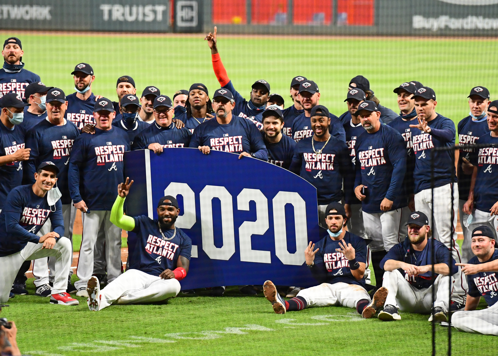

## Portfolio

---

### School Projects 

[Dog Breed Classification via Images (CS6740 Team Project)](/6740_Project_Final_Report.pdf)

---
[Yelp Review Sentiment Analysis (CS6242 Team Project)](/team130report.pdf)

---

### Personal Projects 
[ANOVA for Braves Batting (2020 vs 2021)](/braves_batting_analysis.html)

---
[Kaggle Titanic ML Competition](/titanic.html)

---

### Coursework

- Machine Learning
- Database System Concepts and Design
- Deterministic Optimization
- Bayesian Statistics
- Data and Visual Analytics
- Data Analytics for Business
- Regression Analysis
- Analytics Modeling
- Computing for Data Analytics (Python)
- Business Fundamentals for Analytics

---

---

Page template forked from <a href="https://github.com/evanca/quick-portfolio">evanca</a>

<!-- Remove above link if you don't want to attibute -->
