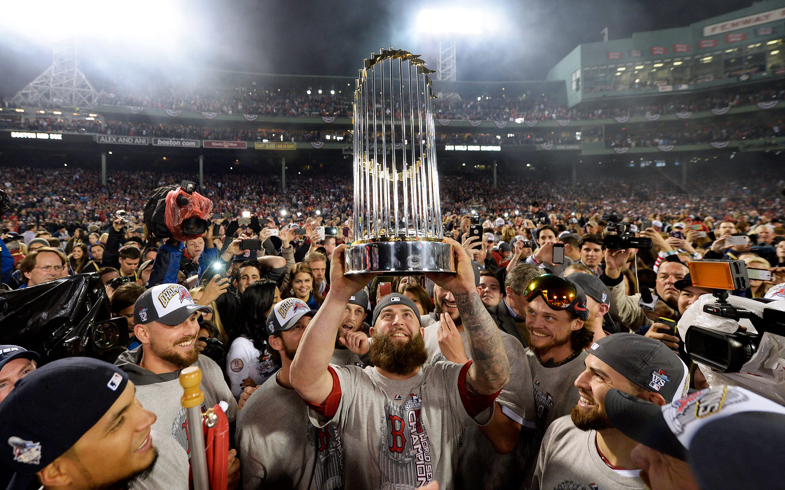

## Portfolio

---

### School Projects 
---
[Dog Breed Classification via Images (CS6740 Team Project)](/6740_Project_Final_Report.pdf)

---
[Yelp Review Sentiment Analysis (CS6242 Team Project)](/team130report.pdf)

---

### Personal Projects 
---
[Predicting MLB Playoff Success with Machine Learning](/playoff.html)

     
---
[ANOVA for Braves Batting (2020 vs 2021)](/braves_batting_analysis.html)

---
[Kaggle Titanic ML Competition](/titanic.html)

---

### Coursework - Masters in Analytics from Georgia Tech

- ISYE6740 - Machine Learning
- CS6400 - Database System Concepts and Design
- ISYE6669 - Deterministic Optimization
- ISYE6669 - Bayesian Statistics
- CDE6242 - Data and Visual Analytics
- MGT6203 - Data Analytics for Business
- ISYE6416 - Regression Analysis
- ISYE6501 - Analytics Modeling
- CSE6040 - Computing for Data Analytics (Python)
- MGT8803 - Business Fundamentals for Analytics

---

---

Page template forked from <a href="https://github.com/evanca/quick-portfolio">evanca</a>

<!-- Remove above link if you don't want to attibute -->
